# Dubai Real Estate ROI Analysis

An end-to-end Dubai real estate analytics project covering data cleaning, exploratory research, machine-learning model development, and an interactive Streamlit dashboard for market analysis, price prediction, and ROI planning.

The complete research process is documented in `note.ipynb`. The notebook is the full analytical record: it walks through the raw data, cleaning decisions, feature engineering, missing-value strategy, model training, validation results, and interpretation. This README summarizes the project at a production level and points to the notebook for the deeper research trail.

## Project Objective

The goal of this project is to turn Dubai real estate transaction data into a practical decision-support tool. The project answers three connected questions:

- What does the Dubai residential sales market look like across time, areas, and property types?
- Can missing room categories be inferred reliably enough to improve the dataset?
- Can a machine-learning model estimate transaction value well enough to support ROI scenario analysis?

The final Streamlit dashboard exposes the project through six main views:

- Market Overview
- Area Comparison
- Price Prediction
- ROI Calculator
- Investment Opportunities
- Model Performance

## Data And Research Workflow

The project uses Dubai transaction data with fields such as transaction date, transaction group, procedure name, property type, property subtype, usage, registration type, area, room category, parking availability, procedure area, transaction value, and price per square metre.

The raw data required standardization because newer and older files use different schemas. The notebook aligns these files into one shared structure so that later analysis and modeling can use consistent feature names.

The research workflow follows this order:

1. Load and standardize raw transaction files.
2. Normalize categorical text values and convert important fields to efficient dtypes.
3. Review missing values, duplicate rows, and invalid numeric values.
4. Explore numerical and categorical distributions.
5. Filter the raw dataset to residential sales records.
6. Remove extreme outliers from price, area, and price-per-square-metre fields.
7. Train a CatBoost model to infer missing `rooms_en` values.
8. Use accepted room predictions to complete the price-modeling dataset.
9. Train an XGBoost model to predict property transaction value.
10. Save reusable model and dashboard artifacts.
11. Build a Streamlit dashboard around the cleaned data and saved models.

## Exploratory Analysis

The raw dataset contains more than one type of real estate event. Sales, mortgages, gifts, land transactions, and development-related procedures can all appear in real estate transaction records, but they do not represent the same economic behavior. The notebook therefore studies the distribution of transaction groups before deciding what should be used for price modeling.

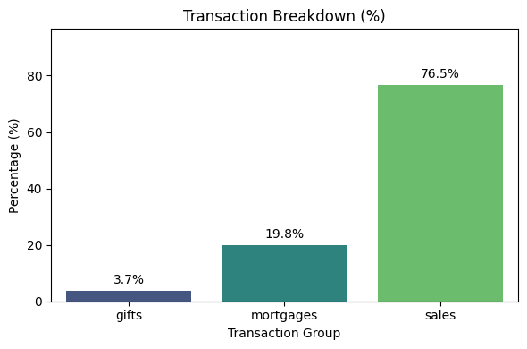

This distribution matters because a price model should not mix fundamentally different transaction meanings. A mortgage record, a gift, and a normal residential sale do not answer the same business question. The final price model focuses on residential sales because that is the most relevant subset for estimating market value and later ROI.

Procedure type is also important. Some procedures represent straightforward resale activity, while others relate to off-plan sales, pre-registration, lease-to-own structures, delayed registration, or development workflows.

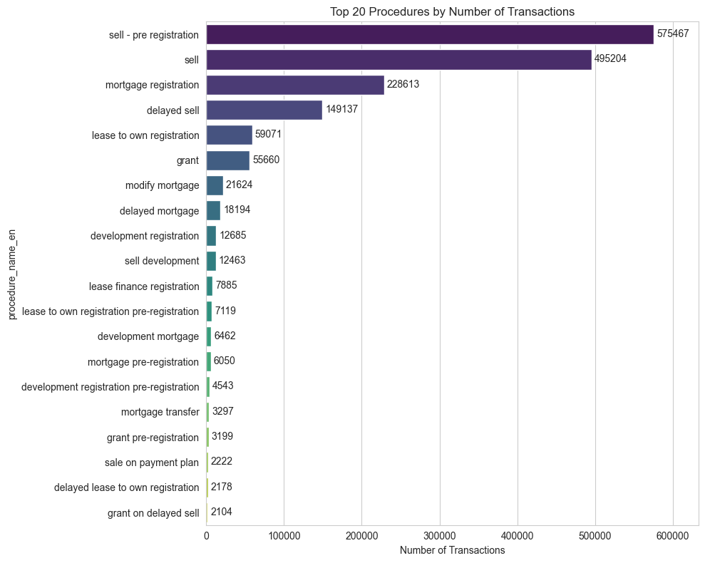

The procedure distribution shows that Dubai real estate data is not just a clean list of ordinary resale transactions. Procedure names carry market context. A property sold through pre-registration or off-plan structures may behave differently from an existing-property resale, so the model keeps procedure and registration fields as predictive features.

Property subtype is another key segmentation variable.

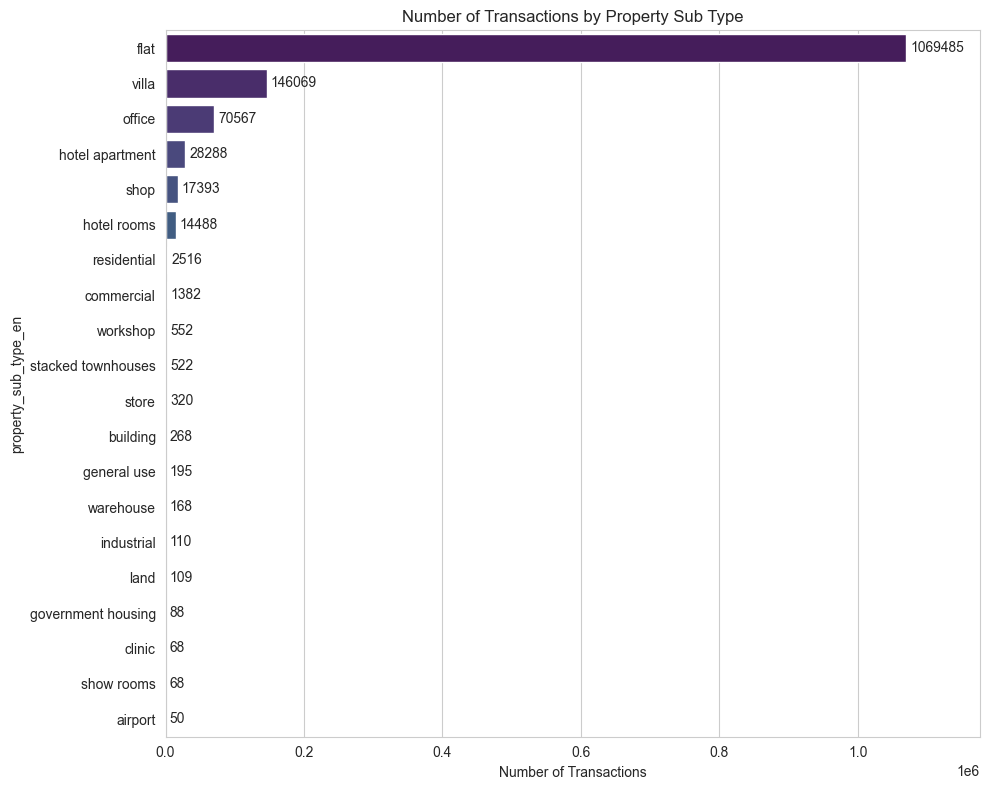

The project narrows the modeling set to residential-style property subtypes such as flats and villas. This is important because land and building records can have very different pricing logic from individual residential units. Keeping the modeling domain narrower improves interpretability and reduces category errors in the dashboard.

## Market Findings

Dubai real estate prices are highly segmented. The same room category and area size can produce very different transaction values depending on location, registration type, procedure type, and property subtype.

Area is one of the strongest business variables in the project. Prime, waterfront, central, suburban, and emerging districts behave differently. The dashboard therefore includes area-level summaries, area comparison charts, and a map view.

Property size is also important, but total value is not explained by size alone. Larger properties usually have higher total transaction values, but price per square metre varies heavily across locations and property categories.

The correlation review supports this idea: numerical variables alone do not fully explain price.

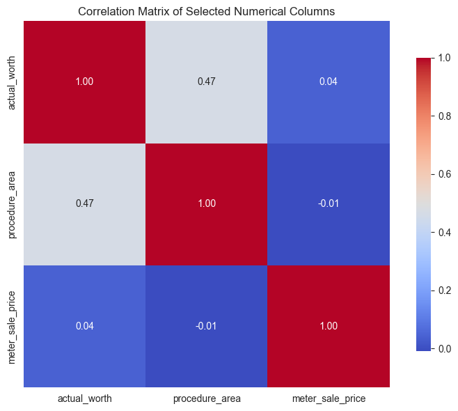

The relationship between transaction value and area becomes easier to inspect after applying a log transform to price. Real estate prices are strongly right-skewed, meaning a small number of expensive properties stretch the raw distribution upward.

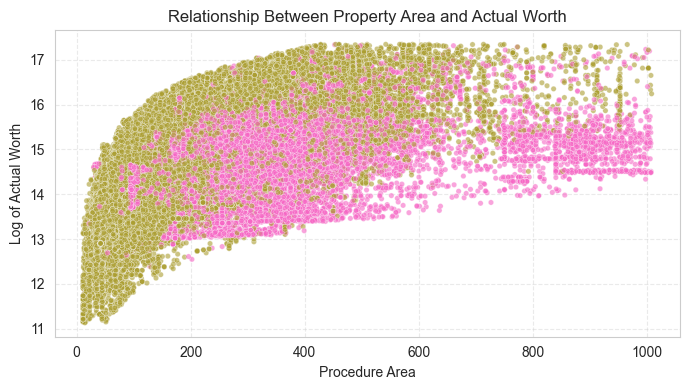

The log transformation compresses extreme prices while preserving rank order. This makes both visualization and modeling more stable. The XGBoost model is therefore trained on `log_actual_worth`, then predictions are converted back to AED.

The time-based analysis also shows why year and month are useful features.

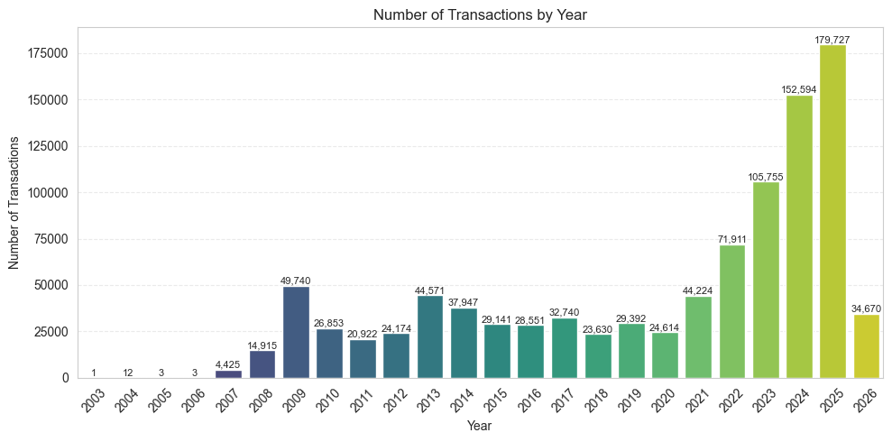

Transaction activity changes over time, so temporal features help the model understand that market behavior is not fixed. The dashboard also uses time fields for filtering and market trend charts.

## Missing Rooms Strategy

The `rooms_en` field is important because room category is closely related to property type, size, buyer expectations, and price. Dropping every row with missing room data would waste useful transaction records, but filling missing values blindly would add noise.

The project uses a CatBoost multiclass classifier to infer missing `rooms_en` values. CatBoost is a strong choice here because it handles categorical features well and can model interactions between area, property type, procedure, usage, parking, and size.

The room model predicts classes such as:

- Studio
- 1 B/R
- 2 B/R
- 3 B/R
- 4 B/R
- 5 B/R
- 6 B/R
- Penthouse
- Single room
- Other

Final holdout performance:

- Accuracy: `0.9033`
- Macro F1: `0.6766`
- Weighted F1: `0.9030`

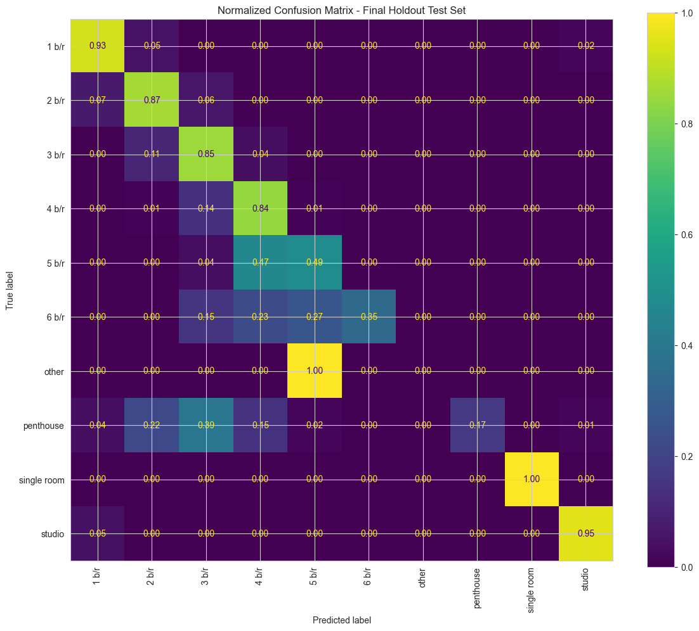

The confusion matrix shows strong performance for common classes such as studio, 1 B/R, 2 B/R, and 3 B/R. These classes have high support, so the model has enough examples to learn stable patterns. Rare classes such as penthouse and high-bedroom categories are harder because there are fewer examples and more overlap with nearby categories.

For the price model, room predictions are handled conservatively. Predictions with sufficient confidence are written into `rooms_en`; low-confidence predictions are left missing and removed later. This keeps the price model from learning from the weakest room imputations.

## Price Prediction Model

The second model predicts `actual_worth`, the registered transaction value of a property.

Model type:

- XGBoost regressor with native categorical handling

Target:

- `log_actual_worth`

Output:

- AED price prediction after inverse log transform

Main features:

- Procedure name
- Property type
- Property subtype
- Property usage
- Registration type
- Area
- Rooms
- Parking availability
- Procedure area
- Advertised area
- Year
- Month

The target is log-transformed because property prices are heavily right-skewed. The model learns patterns on the log scale, then predictions are converted back into AED with `np.expm1`.

Final test performance:

- MAE: `240,843.49 AED`
- RMSE: `598,296.59 AED`
- R2: `0.8892`

MAE is the most intuitive metric for dashboard users because it represents the average absolute AED error. RMSE is also important because it penalizes larger mistakes more heavily, which matters for investment decisions.

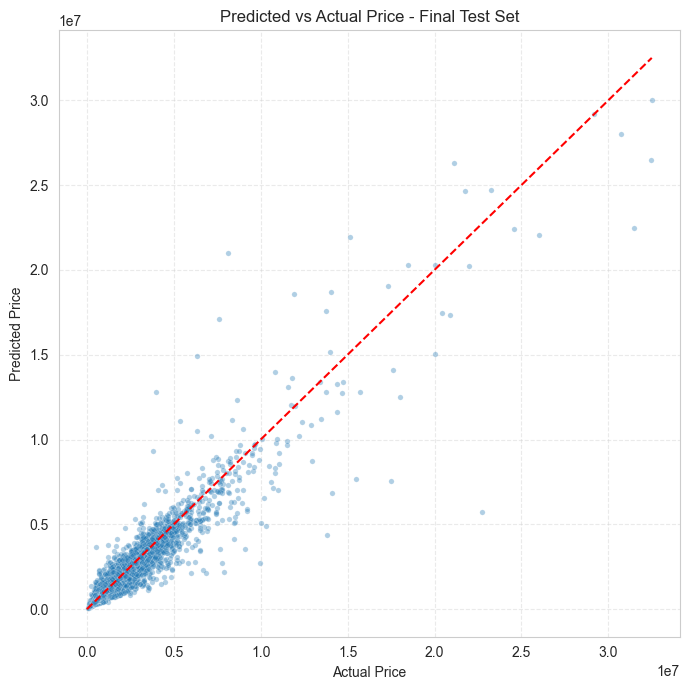

The actual-versus-predicted plot gives a visual check of model fit. Points closer to the diagonal indicate stronger predictions. Wider spread is expected at higher prices because expensive properties are more variable and often depend on details not included in the dataset, such as view, building quality, exact unit condition, floor level, or developer reputation.

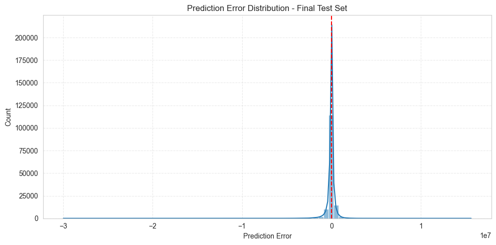

The error distribution helps show whether the model tends to overpredict or underpredict. A centered distribution around zero is preferred. Large tails are expected in real estate because unusually expensive or unusual properties are harder to model from structured transaction fields alone.

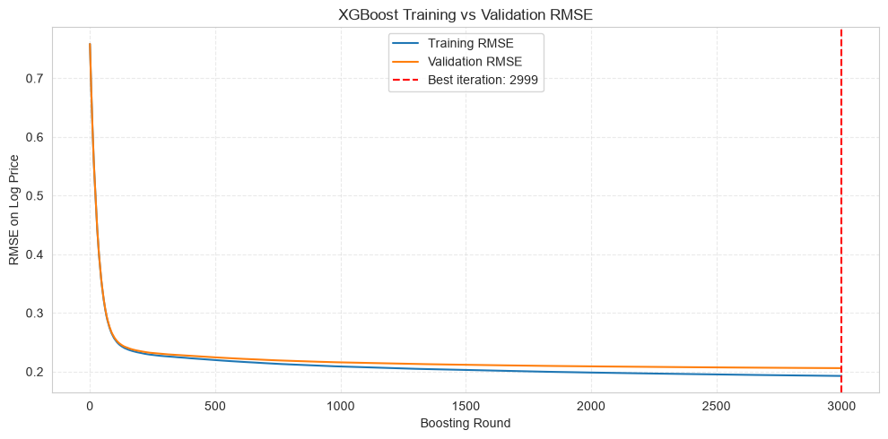

The training curve compares training RMSE and validation RMSE on the log-price scale. Both curves drop quickly early in training, showing that the model learns the strongest relationships quickly. Later rounds improve more slowly. The training and validation curves stay close together, which suggests the model is not heavily overfitting.

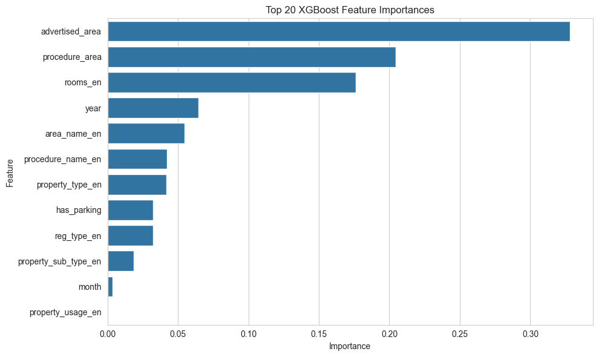

The feature-importance chart shows which variables the XGBoost model relies on most. For this use case, strong importance from area, procedure area, room category, property subtype, and registration context is expected. These are also the variables a real investor would naturally care about when comparing Dubai properties.

## Dashboard Architecture

The dashboard is built with Streamlit and uses reusable backend helpers from `note.py`.

The app does not retrain models. It loads saved model files from `models/`:

- `models/rooms_en_production_final_model.cbm`
- `models/rooms_en_validation_model.cbm`
- `models/xgboost_price_model.json`

The dashboard includes:

- Market-level metrics
- Monthly transaction charts
- Area comparison charts
- Searchable area map
- XGBoost price prediction form
- ROI calculator
- Investment-opportunity ranking
- Model-performance section

## Performance Design

The raw transaction files are large, so loading and cleaning them every time would make the dashboard slow. The project now builds local prepared files:

- `data/dashboard_cache.parquet`
- `data/dashboard.sqlite`

These files are generated locally and ignored by Git. The dashboard reads the prepared cache when it exists, which is much faster than repeatedly parsing and cleaning the full raw CSV.

The price prediction page also filters dropdown options to categories stored inside the saved XGBoost model. This prevents unsupported-category errors when users choose an area or procedure that exists in the broader dashboard data but was not present during model training.

For Streamlit deployment, keep the heavy data files out of GitHub. Host the prepared SQLite database externally and add its URL as a Streamlit secret:

- Recommended: `DASHBOARD_DB_URL` pointing to `dashboard.sqlite`
- Optional local/dev fallback: `DASHBOARD_CACHE_URL` pointing to `dashboard_cache.parquet`
- Optional private access token: `DASHBOARD_DATA_TOKEN`

The app first checks for local prepared files. If they are missing on the deployed server, it downloads the remote database once into the app's temporary filesystem, then loads the dashboard normally.

## Project Structure

```text
ROIProject/
|-- backend/
|   `-- app/
|       |-- main.py
|       |-- schemas.py
|       `-- services.py
|-- frontend/
|   |-- src/
|   |   |-- api.js
|   |   |-- main.jsx
|   |   `-- styles.css
|   |-- index.html
|   `-- package.json
|-- app/
|   `-- streamlit_app.py
|-- data/
|   |-- dubai_area_alias_mapping.csv
|   |-- transactions-2026-07-10.csv
|   |-- Transactions.csv
|   |-- dashboard_cache.parquet
|   `-- dashboard.sqlite
|-- figures/
|   |-- xgboost_training_validation_rmse.png
|   `-- readme/
|       |-- transaction_group_distribution.png
|       |-- top_procedures.png
|       |-- property_subtypes.png
|       |-- numeric_correlation_heatmap.png
|       |-- area_vs_log_price.png
|       |-- yearly_transactions.png
|       |-- rooms_confusion_matrix.png
|       |-- price_actual_vs_predicted.png
|       |-- price_error_distribution.png
|       `-- xgboost_feature_importance.png
|-- models/
|   |-- rooms_en_production_final_model.cbm
|   |-- rooms_en_validation_model.cbm
|   `-- xgboost_price_model.json
|-- note.ipynb
|-- note.py
|-- requirements.txt
`-- README.md
```

## Setup

Create and activate a virtual environment:

```powershell
python -m venv .venv
.\.venv\Scripts\activate
```

Install dependencies:

```powershell
pip install -r requirements.txt
```

## Run The Dashboard

The production-style demo uses FastAPI for the backend and React for the frontend.

Start the API:

```powershell
python -m uvicorn backend.app.main:app --reload --port 8000
```

In a second terminal, start the React frontend:

```powershell
cd frontend
npm install
npm run dev
```

Open the local frontend URL shown by Vite, usually:

```text
http://127.0.0.1:5173
```

The Streamlit prototype is still available:

```powershell
python -m streamlit run app/streamlit_app.py
```

If the default Streamlit port is already being used:

```powershell
python -m streamlit run app/streamlit_app.py --server.port 8503
```

## Streamlit Deployment Data

GitHub should not contain the raw `Transactions.csv` file or the generated `dashboard.sqlite` database. The SQLite file is hundreds of MB and the raw CSV is much larger, so pushing them will either fail or make the repo slow.

The easiest free-friendly deployment setup is:

1. Build `data/dashboard.sqlite` locally.
2. Upload that SQLite file to a file host that can provide a direct download URL.
3. In Streamlit Community Cloud, open the app settings and add:

```toml
DASHBOARD_DB_URL = "https://your-private-or-signed-download-url/dashboard.sqlite"
```

If the host requires a bearer token, also add:

```toml
DASHBOARD_DATA_TOKEN = "your-token"
```

There is an example file at `.streamlit/secrets.example.toml`. Do not commit real secrets.

## Rebuild The Dashboard Cache

The dashboard cache is built automatically if it does not exist. To force a rebuild:

```powershell
python -c "from note import prepare_dashboard_data; prepare_dashboard_data(force_rebuild=True)"
```

## Research Notebook

Use `note.ipynb` to review the complete research process. The notebook contains the full explanation for:

- Data loading and schema standardization
- Data-quality checks
- Feature classification
- Missing-value review
- Residential sales filtering
- Outlier handling
- Room imputation with CatBoost
- Price prediction with XGBoost
- Model evaluation
- Feature importance
- Dashboard preparation

## Limitations

This project is an analytical and educational tool. It should not be treated as financial advice.

The price model estimates transaction value from historical patterns. It does not know property condition, exact building quality, floor level, view, renovation quality, developer reputation, negotiation context, financing terms, or live market sentiment unless those variables are included in the data.

The ROI calculator depends heavily on user assumptions for rent, vacancy, annual costs, fees, and appreciation. It is best used for scenario testing, not as a guarantee of returns.

The map currently uses approximate built-in coordinates for commonly used areas. A future production version should use a complete geospatial lookup or official area boundary file.

## Future Improvements

Useful next steps include:

- Move filtered dashboard aggregations fully into SQL.
- Add rental data so ROI can estimate expected rent automatically.
- Add prediction intervals around the price estimate.
- Add model drift checks when new transaction data is added.
- Add a full geospatial area lookup with official boundaries.
- Package the Streamlit app for deployment.
- Add a FastAPI layer if the project later moves to a React frontend.
